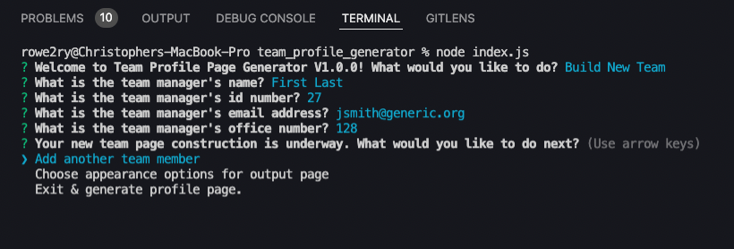
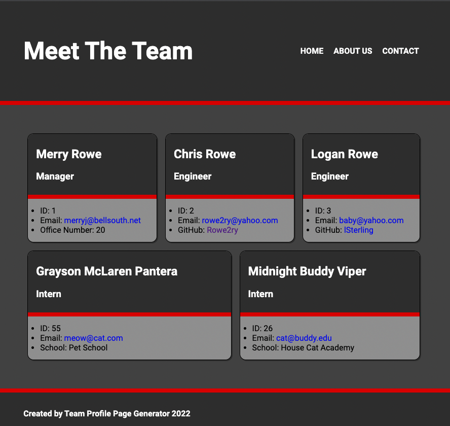
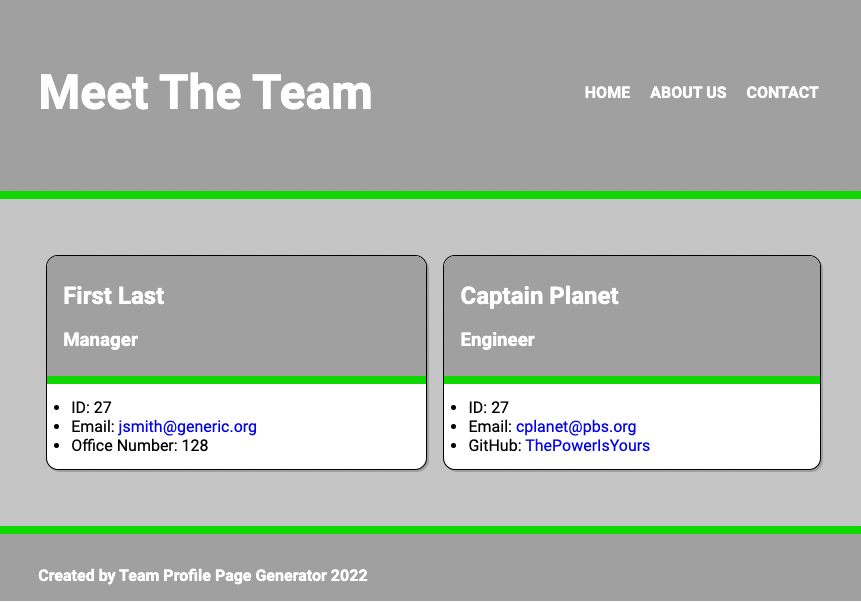

# Team Profile Page Generator  

  

  
  ## Description  

  

  A command line application that can write and style a page for your engineering team.  

  * Motivation  

    To challenge myself to generate dynamic HTML files form a command line application.  

  * Reason for Building  

    I wanted a tool that could display user information in a useful and responsive layout.  

  * Problems Solved  

    Having to style and code a page for a dev team.  

  * Things Learned  

    I learned about using various arrays in the inquirer npm to generate a "main menu" and sub menus in a command line aplication. I learned how to write both HTML and CSS files in node. And I learned how to write and impliment jest tests for making the JS modules bulletproof.  

  

  ## Table of Contents  

  

  * [Installation](#installation)  

  * [Usage](#usage)  

  * [License](#license)  

  * [Contributing](#contributing)  

  * [Tests](#tests)  

  * [Questions](#questions)  

  

  ## Installation  

  

  Navigate to the directory in a command line and enter the following command :  

  

  > node index.js  

  

  ## Usage  

  [Video Demo/Walkthrough](https://drive.google.com/file/d/1ioTmxm6yMS4mar0iMBF8-RSHj7R87CRw/view)

  Once the application is running, use arrow keys to select what you want to do. You can start bulding the team, change the page appearance, and finally, generate a page. Start the new project by adding a team manager, then add as many or as few other team members as you like. Select a dark or light mode, and an accent color.  

  ### Command Line Screenshot
  
  ### Sample of output for dark mode with red accent color.
  
  ### Sample of output for light mode with green accent color.
  
  

  ## License  

  

  [MIT](https://opensource.org/licenses/MIT)  

  

  ## Contributing  

  

  2U Education , Georgia Tech, Jung, my wife  

  

  ## Tests  

  

  install the jest npm and run 
  
  > npm test

  

  ## Questions  

  

  Reach out if you have any questions about this project.
